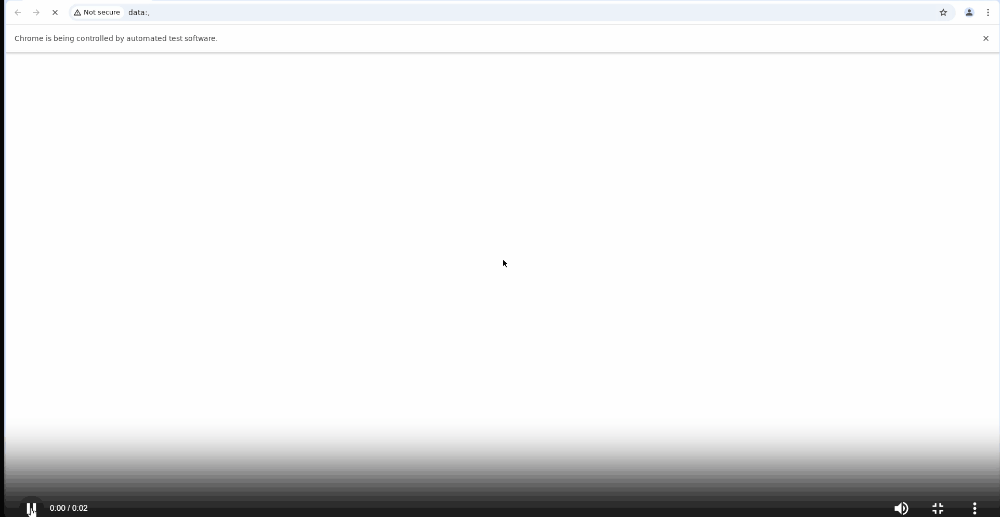
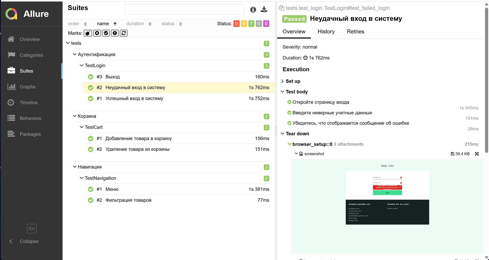
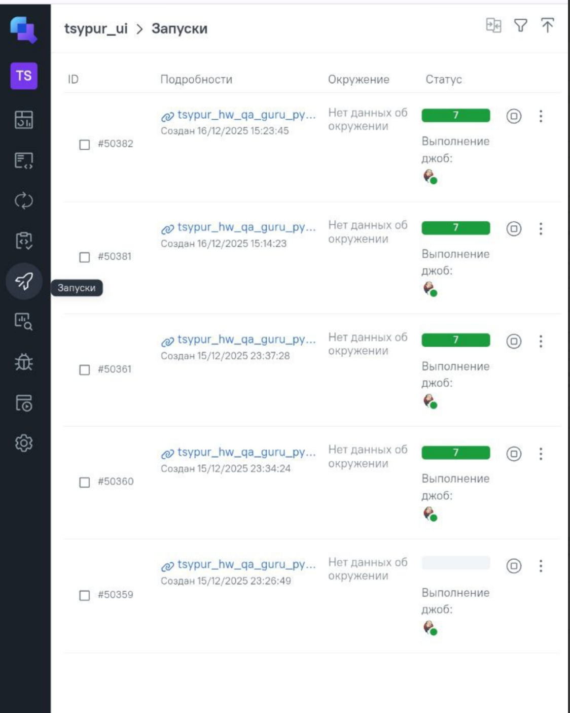
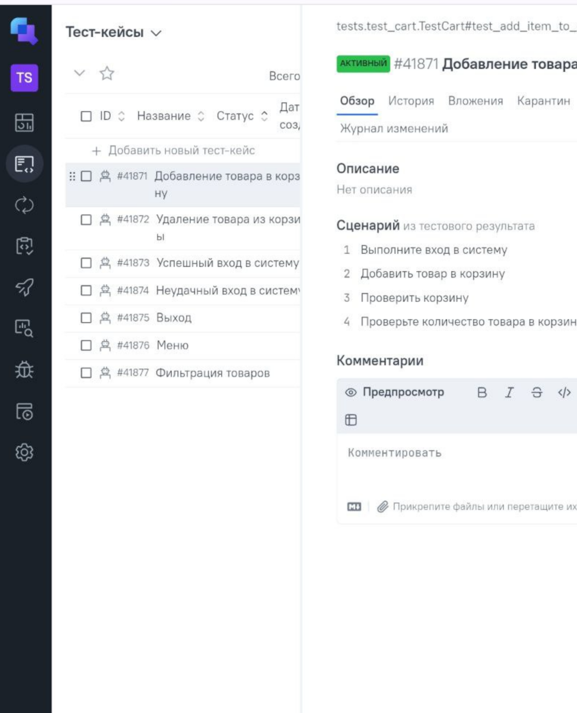
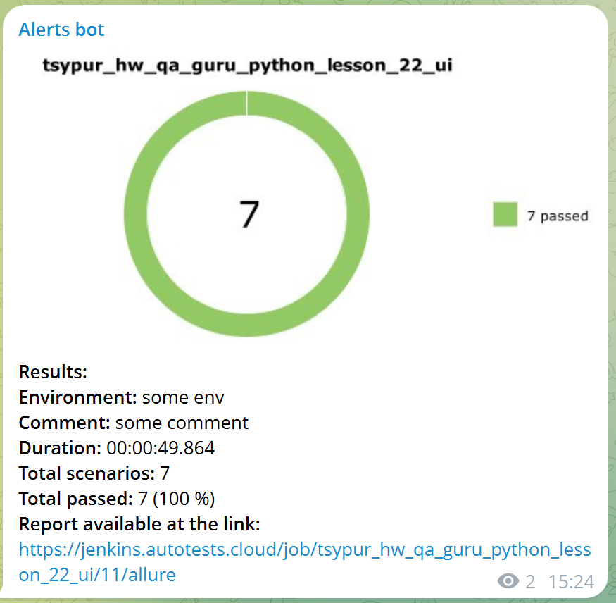

# UI tests automation для проекта Swag Labs

> web-сайт [SauceDemo](https://www.saucedemo.com/)

---

## Содержание проекта

Фреймворк для автоматизации тестирования включающий:

- **Page Object Model (POM)** для поддерживаемой структуры тестов
- **Отчетность Allure** со скриншотами, видео и подробными шагами
- **Облако Selenoid** для масштабируемого выполнения в браузере
- **Jenkins CI/CD** с ручным выполнением заданий
- **Уведомления Telegram** для получения результатов в режиме реального времени
- **Интеграция с Allure TestOps** для управления тестированием

---

## Используемый стек

<p align="center">
<a href="https://www.jetbrains.com/pycharm/"></a>
<a href="https://www.python.com/"></a>
<a href="https://github.com/"></a>
<a href="https://docs.pytest.org/"></a>
<a href="https://aerokube.com/selenoid/"></a>
<a href="https://github.com/allure-framework/allure2"></a>
<a href="https://www.jenkins.io/"></a>
<a href="https://qameta.io/"></a>
</p> 

---

## Запуск теста

### Установка
```bash
# 1. Склонировать репозиторий
git clone https://github.com/tsypur/hw_qa_guru_python_lesson_22_ui
cd hw_qa_guru_python_lesson_22_ui

# 2. Создание виртуального окружения
python -m venv venv

# 3. Активация виртуального окружения
source venv/bin/activate      # macOS / Linux
venv\Scripts\activate         # Windows

# 4. Установка зависимостей
pip install -r requirements.txt
```
### Настройка окружения

```bash
Создание файла `.env` в корне проекта
Файл .env включить в .gitignore
```

### Запуск тестов
```bash
# Запуск всех тестов
pytest tests/ --alluredir=allure-results -v

# Запуск конкретных тестов
pytest tests/test_login.py::TestLogin::test_successful_login -v

# Просмотр Allure report
allure serve allure-results
```

---

#### </a> Демонстрация выполнения теста:



---

### Примеры отчётов

#### </a> <a target="_blank" href="https://jenkins.autotests.cloud/job/C11-voronirina-diploma-UI/46/allure/">Allure Report</a> [Jenkins](https://jenkins.autotests.cloud/job/tsypur_hw_qa_guru_python_lesson_22_ui/) Build


#### Allure Overview  


#### Детали тестового прогона


#### </a> <a target="_blank" href="https://allure.autotests.cloud/launch/38541/">TestOps</a> [TestOps](https://allure.autotests.cloud/project/5055/dashboards) Runs


#### Тест-кейсы TestOps



#### </a> Telegram Notification



